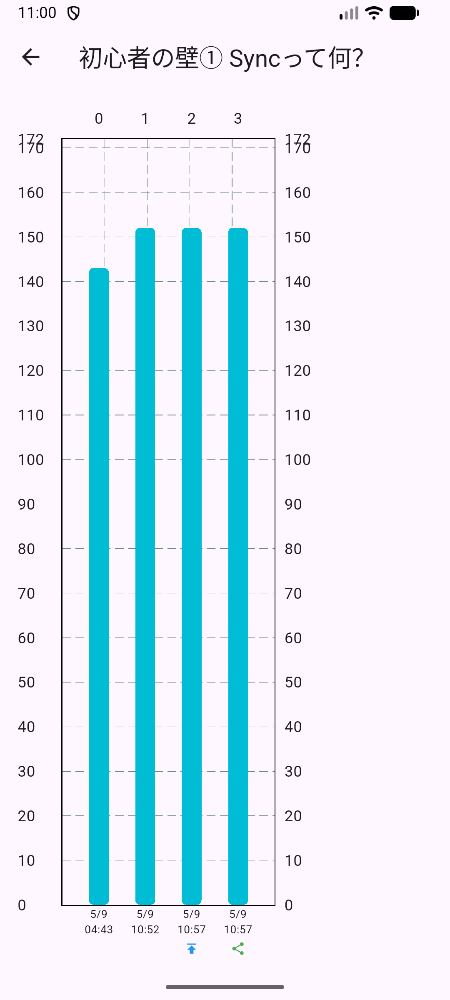
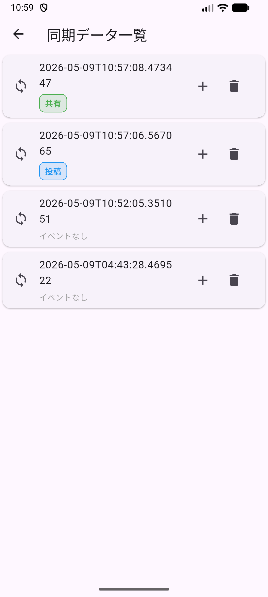

# Qiita Observer

Qiita Observerは、Qiita記事のPV・LGTM・ストック数の推移を可視化し、記事ごとの成長を追跡するための個人開発アプリです。
Flutter + SQLite を使用して、ローカル環境でデータを管理しています。

## 機能概要
- **記事一覧表示**

Qiita APIから取得した記事を一覧表示します。
各記事には以下の情報が表示されます：

PV（閲覧数）  
LGTM数  
ストック数  
前回取得との差分（増減）

- **記事詳細グラフ**

記事をタップすると、その記事のPV推移をグラフで表示します。

時系列でのPV変化  
イベント（投稿・更新など）の表示  
  

- **イベント機能**

記事ごとに以下のイベントを記録できます：

投稿  
共有  
更新  
その他（カスタム）※詳細メモは未実装

イベントはグラフ上にアイコンとして表示され、PV変化との関連を確認できます。

- **同期データ管理**

データは「sync単位」で管理されています。  
1回の同期ごとに以下が保存されます：

snapshots（記事状態）  
events（操作ログ）

同期履歴を一覧で確認・削除することも可能です。  
  

## インストール方法
右側のreleaseからAPKをダウンロードしてください。  
Android実機での動作を確認しています。  
本アプリは個人開発のため、予期しない不具合やデータの欠損が発生する可能性があります。  
重要なデータはバックアップの上、ご利用ください。  

## 使い方
**1. アプリ起動**

アプリを起動すると、APIキー入力画面が表示されます。  
Qiitaの「個人用アクセストークン」を入力してください。  
取得方法：
https://qiita.com/settings/applications

必要な権限：
read_qiita

**2. データ同期**  
アプリ起動時に、同期処理が行われ、Qiita APIから最新データを取得します。  
任意のタイミングで同期したい場合は右下の同期ボタンを押してください。  
同期により、記事のPV・LGTM数などのスナップショットが保存されます。

**3. 記事詳細を見る**  
任意の記事をタップすると、PV推移グラフが表示されます。

**4. 同期データ管理、イベント追加**  
過去の同期データを一覧で確認・削除できます。  
また、同期データにイベントを追加できます。

**5. イベント管理**  
イベント一覧からイベントの削除ができます。

**6. データのエクスポート・インポート**  
エクスポートを押すと、Downloadフォルダに２種類のCSVファイルが保存されます。  
①snapshots_YYYYMMDD_HHMMSS.csv  
記事スナップショットデータ（記事ごとのPV・LGTM・ストック数）  
  
②events_YYYYMMDD_HHMMSS.csv  
イベントデータ（記事に対して記録されたイベント情報）  

インポート時はそれぞれ対応する形式のファイルを選択し、インポートしてください。  
**インポートすると、それまでのデータは上書きされます**

##  技術構成
Flutter  
SQLite（sqflite）  
Qiita API  
fl_chart（グラフ描画）

## 注意事項
本アプリは個人開発・学習目的です。  
Qiita公式アプリではありません。  
データはローカルDBに保存されます。  
**このアプリは「Qiita記事の成長を観察する」という実験的な目的で開発しています。**
